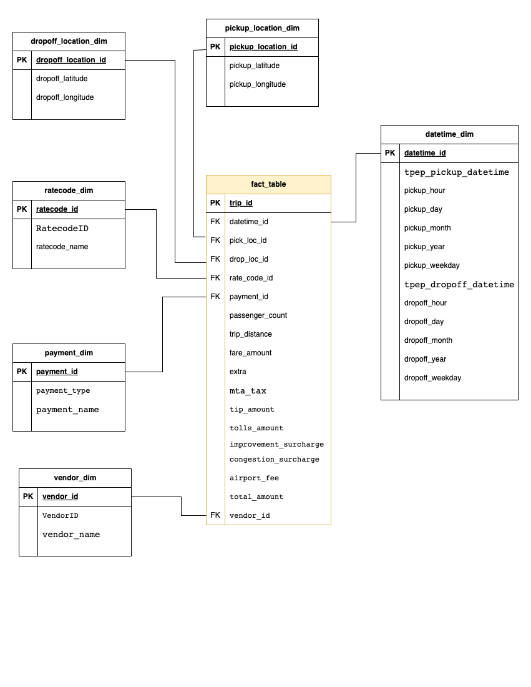

# NYC TLC DATA ENGINEERING 
This project focus on NYC TLC Data Analysis using Python, GCP Storage, Compute Engine, Mage Data Pipeline Tool, BigQuery, and Looker Studio. Aims to extract insights from the dataset for informed decisions and deeper operational understanding.

### Interactive Dashboard Walkthrough
[Watch Here](https://youtu.be/0o6VXLd1TR8)

### Data Source 
[NYC TLC](https://www.nyc.gov/site/tlc/about/tlc-trip-record-data.page)

### Data Modeling

